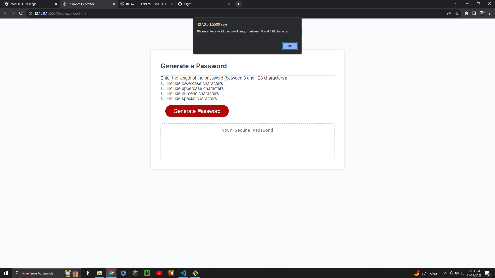

# Password Generator Starter Code
It was my goal to create a working, randomized password generator. To do this, I had to edit my JS starter code and HTML elements, then link the two. 

I used charsets for lowercase, uppercase, special characters, and numbers. 

I linked these charsets to the HTML, where I created a button for each set. 

The user has the ability to click at least 1 and up to all 4 boxes, to generate a random password. 

The user also has the ability to choose how long they want the password to be with a box displayed on the right. 

I also ensured the minimum number of characters were 8 and the maximum were 128, which is displayed on the screen for the user as well. 

When the user clicks the red button to generate a password, it will appear below in the aria-label text box.

There was a 404 error when uploading the live page, so I had to download the starter code once again and paste my existing code into a new file. 

Here is the link to the live site - https://egamer13.github.io/random-password-generator/

